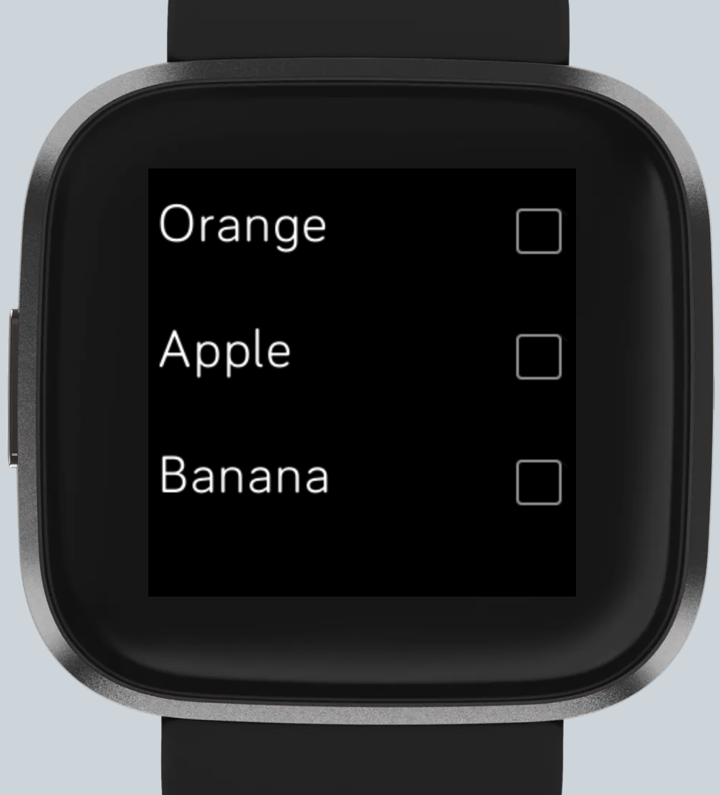

fitbit-todo
===========

This repo includes a fitbit app to manage your Microsoft ToDo tasks from
the watch. You can see the list and mark tasks as completed.

Building
--------

In order to build the app locally you need to install the NPM dependencies:

    npm install

Build the app:

    npx
    build

Install it:

    npx
    install

Or both combined:

    npx
    build-and-install

To be able to install the app you can either use the Fitbit OS Simulator
or your own phone and Fitbit device.

In the OS simulator the application unfortunately fails with a cross-origin issue though.
This issue was raised in the fitbit forum already:
<https://community.fitbit.com/t5/SDK-Development/Avoid-quot-origin-null-quot-set-in-POST-request/m-p/4860950>

To actively develop the application you unfortunately need a real hardware device then.

Read more about it here:
<https://dev.fitbit.com/getting-started/>

More information about the building process can be found at:
<https://dev.fitbit.com/build/guides/command-line-interface/>

Authentication
--------------

Authenticating with Microsoft ToD is a bit tricky. You need to create
an app in the Azure Active Directory and add a client secret. From there
retrieve the client\_id & client\_secret.

Learn more about this here:
<https://docs.microsoft.com/en-us/azure/active-directory/develop/howto-create-service-principal-portal>

Afterwards you also need to retrieve the refresh token to be able to
grab a new token for every API call. The process to retrieve the refresh
token is described here:
<https://docs.microsoft.com/en-us/advertising/guides/authentication-oauth-get-tokens>?

All these values have to be set in the settings part of the app in the
phone then.

This section is still a bit vague and could include more precise
instructions. I\'m myself not super knowledge about the OAuth setup of
Microsoft though.

Configuration
-------------

Optionally you can pass a list ID if you want to retrieve tasks of a
specific list. The ID can e.g. be retrieved by using the browser version
of ToDo and inspecting the URL, it should look like this:
<https://to-do.live.com/tasks/>\<list-id\>

If no list ID is configured it will use your default list.

Resources
---------

Everything related to developing for Fitbit devices can be found here:
<https://dev.fitbit.com/>

ToDo
----

-   Force re-paint in case task gets resolved to make row disappear
-   Avoid scrolling into the void by only keeping the visible tasks in
    the viewport
-   Fix formatting of JS
-   Keep sorting of tasks as it is in given list, sorting by importance in desktop app works
-   Clean up CSS
-   Add refresh button
-   Nicer visual effect if tasks gets marked as completed, right now it disappears directly. Maybe there can be animations?
-   Decrease font size, longer tasks don't fit into the screen
-   Let user dynamically choose a list from the app

Disclaimer
----------

I tested the application in the simulator for all devices, but only own
a real Versa 2 device. I can\'t guarantee it looks well on other
devices.

Also I\'m actually a python backend developer and consequently my JS and
*making things look nice* experience is very limited.
